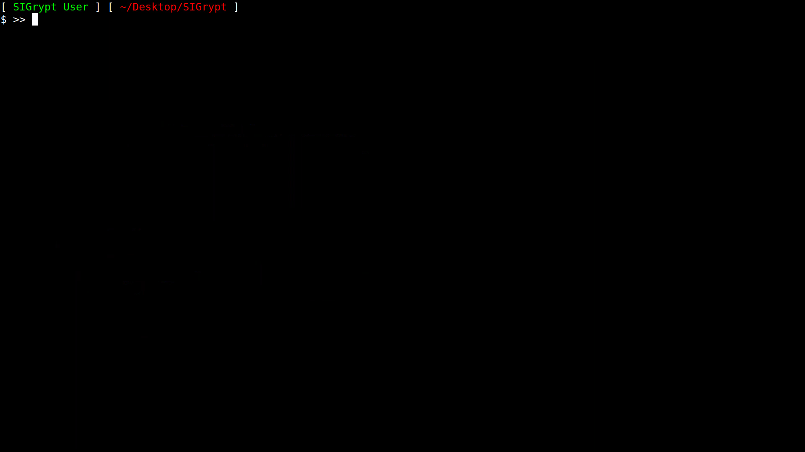

# SIGrypt

### This software uses zero libraries!

SIGrypt is an end-to-end encrypted and LoRa-based communication software. Operates on quantum resistant cryptography such as AES-256, SHA-384, and HMAC-SHA384. Designed to be a PSK model and P2P.

---
🇺🇸 **CONFIGURED FOR USE IN THE UNITED STATES** 🇺🇸
---

## Requirements

- x86-64 Linux System
- CPU with AES-NI
- Reyax RYLR998 LoRa Module
- USB to TTL Serial Converter
  
---

---

## Build

🔌 For help with wiring from TTL to USB check images/connections.webp

---

## Dependency-Free

This repository uses zero libraries for **portability**, **transparency**, and **attack surface reduction**.

---

## Cryptography

- Native AES-256-CTR  : Passed official NIST SP 800-38A CTR and IETF RFC3686 CTR official test vectors
- Native SHA-384      : Passed official NIST test vectors (SHA384ShortMsg.rsp, SHA384LongMsg.rsp, SHA384Monte.rsp)
- Native HMAC-SHA384  : Passed official NIST test vectors (HMAC.rsp)

---

## Replay Protection

Anti-replay techniques are employed such as:

- **Duplicate ID Caching**: Caches the 2 most recent message IDs (Rejects payload if its ID is already cached)
- **Time-sensitive Validation**: Rejects old payloads (Payload Age > 30 seconds)
- **Cryptographically Binded**: Binds timestamp of payload using native HMAC-SHA384

---

## Default AT Settings

| Setting | Location |
|---|---|
| Spreading Factor: AT+PARAMETER=8,7,1,8 | include/behaviour_config.inc |
| Network ID: AT+NETWORKID=18 | include/behaviour_config.inc |
| Mode: AT+MODE=0 | include/behaviour_config.inc |
| Output Power: AT+CRFOP=20 | include/behaviour_config.inc |
| Receiver Address: AT+ADDRESS=7775 | include/behaviour_config.inc |
| Sender Address: AT+ADDRESS=7776 | include/behaviour_config.inc |
| Frequencies: Frequency hopping with 1 of the 20 tables containing 50 shuffled frequencies (908 MHz to 920.25 MHz). When sorted, distance between adjacent frequencies is 250 kHz | include/frequency_variations.inc |

**FCC Part 15 note:** Plaintext input is capped at **1024 bytes** to help limit on-air time (dwell/occupancy) when frequency hopping, in an effort to stay within FCC Part 15 expectations.

SIGrypt is designed to **not** transmit if input is > 1024 bytes.

## Regulatory / legality (US-only configuration)

- This project is **configured for the US 902–928 MHz ISM band**.
- It is **not intended for use in other countries/regions**.
- **You are responsible for legal operation and compliance** with FCC rules (frequency use, transmit power, antenna, hopping/dwell time, duty cycle, and any required labeling/testing for your finished device).  
- **FCC-certified modules do not automatically make your full build/product compliant.**
- This software is provided **as-is** with no warranty of regulatory compliance.
  
---

## Future Goals

- Maintain the repo and update regularly
- Increase compatibility to the HackRF One board
